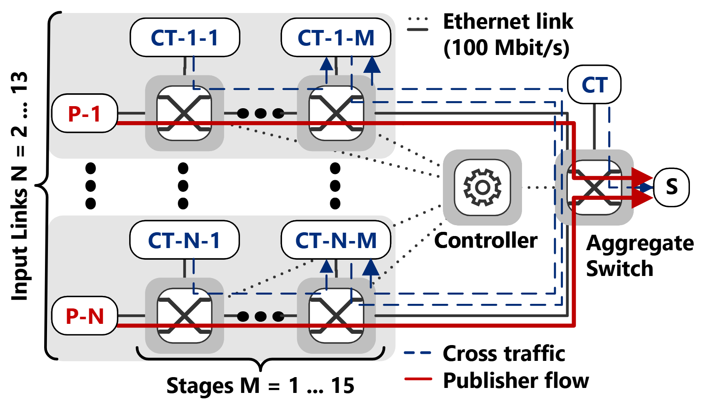

# CBS Maximum Latency Study

## Reference

> Timo Salomon, Lisa Maile, Philipp Meyer, Franz Korf, Thomas C. Schmidt, "Negotiating Strict Latency Limits for Dynamic Real-Time Services in Vehicular Time-Sensitive Networks," Vehicular Communications, Elsevier, 2025. (in press)
```bibtex
@Article{smmks-nslld-25,
  author = {Timo Salomon and Lisa Maile and Philipp Meyer and Franz Korf and Thomas C. Schmidt},
  title  = {{Negotiating Strict Latency Limits for Dynamic Real-Time Services in Vehicular Time-Sensitive Networks}},
  journal = {Vehicular Communications},
  pages = {},
  volume = {},
  number = {},
  year = {2025},
  month = {},
  nope= "In Press",
  publisher = {Elsevier},
  doi   = {10.1016/j.vehcom.2025.100985},
}
```

## Scenario
We establish near worst-case conditions in this scenario.
Publishers in two to thirteen input links (N) send to a subscriber via a series of one to fifteen switch stages (M), paired with a cross traffic (CT) generator. An aggregate switch merges the input links and connects to the subscriber. The link bandwidth is 100 Mbit/s.

Publishers send one frame every 125 µs with highest priority. 
Their frame size varies with the number of input links to achieve a total of 75 Mbit/s sent to the subscriber.

Each CT targets one link in the publisher’s path, sending traffic to the next CT node, which allows for maximum interference. The last node in the chain sends to the next input link via the aggregate switch. A final CT sends to the subscriber through the aggregate switch.

In our study, the CT along the stages either sends full-size Ethernet frames as best effort (BECT), or frames with the same priority as the publishers (PCT). 
The PCT is configured to utilize the remaining bandwidth left by the publisher to reach the total of 75 Mbit/s on each input link. 
The CT interval is set to 100 ms to produce repeatable burst patterns.




## Configurations
CMI configurations:
The controller determines bandwidth usage through TSN standard formulas using the class measurement interval of 125us for all streams.

SI configurations:
The controller determines bandwidth usage through TSN standard formulas using each streams interval.

NC configurations:
nc_config.ini includes static bandwidth configurations for the full parameter study determined with the DYRECtsn open source framework: https://github.com/Kathess/DYRECTsn
